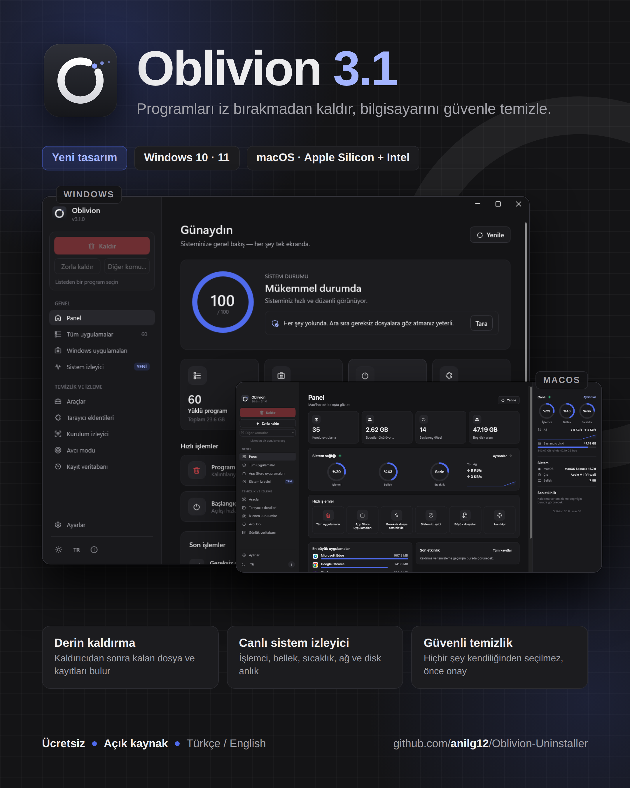
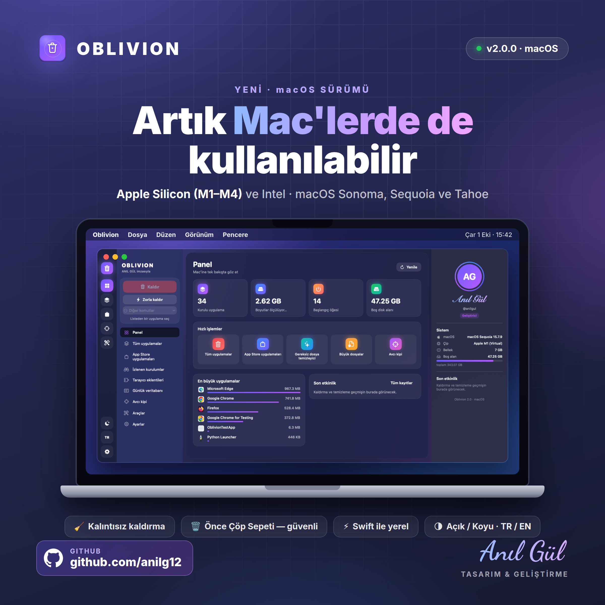

  

  
  
  

---

Yaptığım projelerin hepsine tek yerden ulaşmak için tuttuğum repo. Kartlara tıklayınca ilgili projeye gidiyor. Projeleri tanıtırken kullandığım LinkedIn görselleri de en altta.

## Uygulamalar

  
  

  
  

## Windows hafifletme

  
  

Emberwise'ın ilk hali olan, 2025'te JavaFX ile yazdığım **[Odak Menajeri RPG](https://github.com/anilg12/Odak-Menajeri-RPG)** de duruyor; o repoda hem eski sürümün kaynağı hem de yeni sürüme yönlendirme var.

## Kısaca

| Proje | Ne | Teknoloji | Platform |
|---|---|---|---|
| [Emberwise](https://github.com/anilg12/Emberwise) | Odak ve görev takibini oyuna çeviren RPG | Svelte 5, TypeScript, Electron | Windows, macOS |
| [Oblivion](https://github.com/anilg12/Oblivion-Uninstaller) | Kalıntısız program kaldırma ve sistem temizliği | C# / WPF, SwiftUI | Windows, macOS |
| [SPEKTRA](https://github.com/anilg12/Spektra) | Elektronik harp RF spektrum simülatörü | Java 21, JavaFX | Windows |
| [StockFlow](https://github.com/anilg12/StockFlow) | Stok ve müşteri yönetimi (bitirme projesi) | Python, tkinter, SQLite | Windows, Linux, macOS |
| [win11-ltsc-lite](https://github.com/anilg12/win11-ltsc-lite) | Hafifletilmiş Windows 11 LTSC preset'i | NTLite | Windows 11 |
| [Win10 NTLite Log](https://github.com/anilg12/Win10NTLiteLog) | Windows 10 hafifletme notlarım | NTLite, Batch | Windows 10 |

## LinkedIn görselleri

Oblivion'un macOS sürümü ve 3.1 güncellemesi için hazırladığım paylaşım görselleri.

  
  

  Anıl Gül · Malatya

